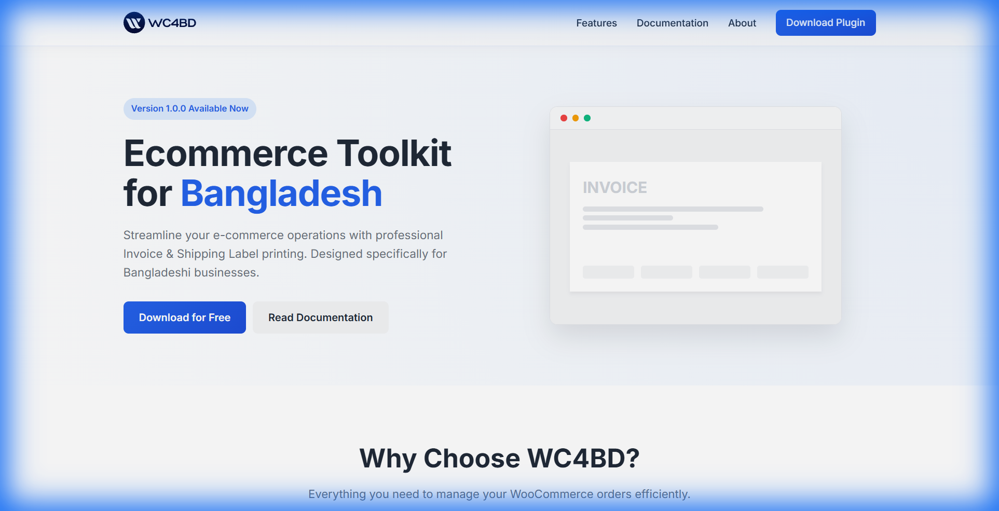
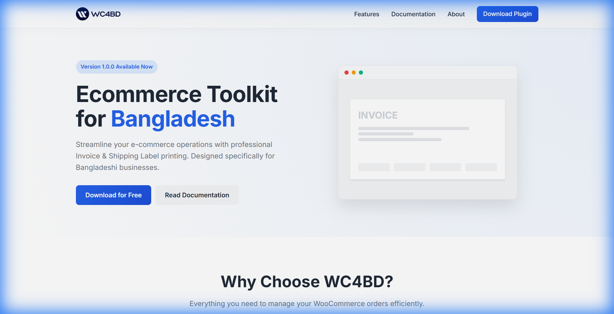
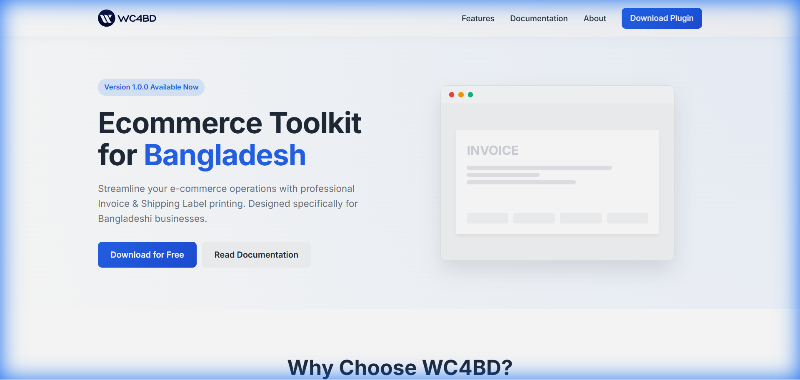

# WC4BD Landing Page

<div align="center">

**Professional Landing Page for WC4BD - WooCommerce Toolkit for Bangladesh**

A modern, responsive, and feature-rich landing page showcasing the essential WooCommerce toolkit designed specifically for Bangladeshi e-commerce businesses.

[](https://wc4bd.commercians.com)
[](https://wordpress.org/plugins/wc4bd/)
[]()
[]()
[]()
[]()

</div>

---

## 📸 Screenshots & Demo

### Live Interactive Demo


### Responsive Design in Action


### Desktop View


### Mobile View (375px)


### Full Page Preview


### Responsive Breakpoints
- **320px Mobile**


- **375px Phone**


### Responsive Optimization Details
<video width="100%" autoplay loop muted playsinline>
  <source src="assets/responsive-optimization.webp" type="video/webm">
  Your browser does not support the video tag.
</video>

---

## 🎬 Visual Highlights

### Key Design Elements
- ✨ **Gradient Hero Section** - Eye-catching blue-to-purple gradient with radial blur effects
- 🎨 **Glassmorphism Header** - Modern frosted glass sticky navigation
- 📱 **Smooth Mobile Animations** - Hamburger menu with flip animations
- 🚀 **Hover Effects** - Interactive cards that lift on hover
- 🌈 **Feature Cards** - Icon-based grid with smooth transitions

### Interactive Components
- Dynamic mobile menu toggle with smooth transitions
- Responsive feature cards with hover animations
- Timeline documentation steps with hover effects
- About section cards with gradient backgrounds
- Smooth scroll navigation to page sections

---

### 🎨 **Premium Design & UX**

#### Modern Visual Design
- **Gradient Accents** - Eye-catching primary color gradients (blue to purple)
- **Glassmorphism Effect** - Frosted glass sticky header with smooth animations
- **Smooth Animations** - CSS transitions for all interactive elements
- **Professional Typography** - Inter font family for clean, modern look
- **Consistent Color Scheme** - CSS custom properties for easy theming
- **React Components** - Modular, reusable component architecture

#### User Experience Excellence
- **Intuitive Navigation** - Clear menu structure with smooth scroll anchors
- **Visual Hierarchy** - Proper heading structure for scannability
- **Call-to-Action Buttons** - Prominent download and documentation links
- **Interactive Elements** - Hover effects on cards, buttons, and links
- **Mobile Menu** - Responsive hamburger menu with smooth animations
- **Optimized Performance** - Fast load times with modern build tools

---

### 📱 **Fully Responsive Design**

#### Mobile-First Approach
✅ **Mobile (< 768px)**
- Stacked layout for optimal readability
- Touch-friendly tap targets
- Hamburger menu with smooth slide animation
- Full-width CTA buttons
- Single column feature grid

✅ **Tablet (768px - 1199px)**
- Two-column layout for features
- Optimized spacing and padding
- Readable text sizes
- Balanced hero section

✅ **Desktop (≥ 1200px)**
- Multi-column grid layouts
- Side-by-side hero content/image
- Maximized screen real estate
- Enhanced hover effects

---

### ⚡ **Performance & Optimization**

#### Technical Performance
- **Fast Build** - Vite development server for instant HMR
- **React 19** - Latest React version with improved performance
- **TypeScript** - Type-safe development experience
- **Optimized Bundle** - Production builds are highly optimized
- **Modern Tooling** - ES modules and modern JavaScript

#### SEO & Accessibility
- **Semantic Markup** - Proper HTML structure for accessibility
- **Alt Text** - Descriptive alt attributes on all images
- **ARIA Labels** - Screen reader support
- **Heading Hierarchy** - Logical H1 → H2 → H3 structure
- **Mobile Meta** - Viewport and touch optimization

---

### 🎯 **Section Breakdown**

#### **1. Hero Section**
- Gradient background with radial blur effect
- Version badge with pill design
- Large heading with color highlight
- Dual CTA buttons (primary/secondary)
- Animated mockup window preview with invoice illustration

#### **2. Features Grid**
- **4-column responsive grid** 
- Icon-based visual hierarchy (emojis for instant recognition)
- Cards with hover lift effect
- Features:
  - 📄 Professional Invoices
  - 🏷️ Thermal Shipping Stickers (75x100mm)
  - ⚡ Bulk Actions
  - 🚀 Lightweight & Fast Performance

#### **3. Documentation Timeline**
- Visual step-by-step guide with numbered circles
- Vertical connector styling
- Step icons in pill containers
- Time estimates and badges
- Hover animations
- 3 clear steps:
  1. 📦 Installation (2 min)
  2. ⚙️ Configuration (5 min)
  3. 🚀 Start Using (1 min)

#### **4. About Section**
- **3-card grid layout**:
  1. **Developer Card** - Avatar, bio, social links
  2. **Statistics Card** - Version, license, compatibility
  3. **Mission Card** - Vision with checkmark list

#### **5. Footer**
- Copyright notice
- Commercians branding link
- Minimal, clean design

---

## 🚀 Quick Start

### Prerequisites
- Node.js 16.0 or higher
- npm or yarn package manager
- A modern code editor (VS Code recommended)

### Installation & Development

1. **Clone the repository:**
```bash
git clone https://github.com/MahmudRiazBD/WC4BD-Landing.git
cd WC4BD-Landing
```

2. **Install dependencies:**
```bash
npm install
# or
yarn install
```

3. **Start development server:**
```bash
npm run dev
# or
yarn dev
```

4. **Visit:** `http://localhost:3000`

### Build for Production

```bash
npm run build
# or
yarn build
```

This generates optimized files in the `dist/` directory.

### Preview Production Build

```bash
npm run preview
# or
yarn preview
```

---

## 🚀 Deployment

### Deploy to Cloudflare Pages (Recommended)

**Method 1: Automatic via GitHub Actions (Best)**

1. **Setup GitHub Secrets:**
   - Go to GitHub repository Settings → Secrets and variables → Actions
   - Add these secrets:
     - `CLOUDFLARE_API_TOKEN`: Your Cloudflare API token (get from [Cloudflare dashboard](https://dash.cloudflare.com/profile/api-tokens))
     - `CLOUDFLARE_ACCOUNT_ID`: Your Cloudflare Account ID (from [Cloudflare dashboard](https://dash.cloudflare.com/))

2. **The workflow file is already configured** at `.github/workflows/deploy.yml`

3. **Deploy:**
   - Just push to `main` branch
   - GitHub Actions will automatically build and deploy to Cloudflare Pages

**Method 2: Manual via Cloudflare Dashboard (Recommended for now)**

1. Go to [Cloudflare Pages](https://pages.cloudflare.com/)
2. Click "Create a project" → "Connect to Git"
3. Select your repository
4. Use these build settings:
   - **Framework preset:** None
   - **Build command:** `npm run build`
   - **Build output directory:** `dist`
   - **Deploy command:** Leave empty
5. Click "Save and Deploy"

**Important Notes:**
- The `_worker.js` file handles routing and serves your React app correctly
- The `wrangler.toml` configuration tells Cloudflare how to serve your static files
- For SPA (Single Page Application) routing to work, these files must be present

### Deploy to Vercel

```bash
vercel --prod
```

Or connect your Git repository to Vercel for automatic deployments.

### Deploy to Netlify

```bash
netlify deploy --prod --dir=dist
```

Or connect your Git repository to Netlify for automatic deployments.

### Deploy to GitHub Pages

```bash
npm run build
# Then push dist folder to gh-pages branch
```

## 📁 Project Structure

```
WC4BD-Landing/
├── src/
│   ├── App.tsx                  # Main React component
│   ├── Logo.tsx                 # Logo component
│   ├── index.tsx                # React entry point
│   └── style.css                # Global styles
├── index.html                   # HTML entry point
├── vite.config.ts              # Vite configuration
├── tsconfig.json               # TypeScript configuration
├── package.json                # Dependencies & scripts
├── metadata.json               # Project metadata
├── assets/
│   └── screenshots/
│       ├── desktop-view.png
│       ├── mobile-view.png
│       └── landing-page.png
└── README.md                   # This file
```

---

## 🛠️ Technologies Used

### Core Technologies
- **React 19** - Modern UI library with latest features
- **TypeScript 5.8** - Type-safe JavaScript development
- **Vite 6.2** - Next-generation frontend build tool
- **CSS3** - Modern styling with animations and flexbox/grid

### Development Tools
- **Node.js** - JavaScript runtime
- **npm/yarn** - Package manager
- **Vite Plugins** - React plugin for JSX support

### Key Features in Code
- **Component-Based Architecture** - Modular, reusable components
- **React Hooks** - Modern state management with useState
- **CSS Modules Ready** - Scalable styling approach
- **Type Safety** - Full TypeScript coverage

---

## 🎨 Customization Guide

### Color Palette
The design uses CSS custom properties for easy theming. Update these in `src/style.css`:

```css
:root {
    --primary-color: #2563eb;      /* Primary Blue */
    --primary-dark: #1d4ed8;       /* Hover Blue */
    --secondary-color: #f3f4f6;    /* Light Gray */
    --text-color: #1f2937;         /* Dark Gray */
    --text-light: #6b7280;         /* Medium Gray */
    --accent-color: #10b981;       /* Success Green */
    --bg-color: #ffffff;           /* White */
    --font-family: 'Inter', sans-serif;
}
```

### Logo & Branding
1. Update the `Logo` component in `src/Logo.tsx`
2. Modify branding text in `src/App.tsx`
3. Update color scheme in `src/style.css`
4. Customize meta tags in `index.html`

### Content Updates
All content is defined in `src/App.tsx`. Simply modify:
- Hero section text and buttons
- Feature descriptions
- Documentation steps
- About section information
- Social links and URLs

---

## 🌐 Browser Support

Tested and fully compatible with:

- ✅ **Chrome** 90+ (Windows, Mac, Linux, Android)
- ✅ **Firefox** 88+ (Windows, Mac, Linux)
- ✅ **Safari** 14+ (Mac, iOS)
- ✅ **Edge** 90+ (Windows, Mac)
- ✅ **Opera** 76+ (Windows, Mac)
- ✅ **Mobile Browsers** (iOS Safari, Chrome Mobile)

---

## 📱 Responsive Breakpoints

| Device Type | Width Range | Layout | Font Scale |
|------------|-------------|--------|-----------|
| **Mobile** | < 768px | 1 column | 90% |
| **Tablet** | 768px - 1199px | 2 columns | 100% |
| **Desktop** | ≥ 1200px | 3-4 columns | 100% |

---

## 📦 WC4BD Plugin Information

This landing page promotes the **WC4BD WordPress Plugin**, which provides:

### Plugin Features
- 📄 **Professional Invoice Generation** - Customizable templates
- 🏷️ **Thermal Shipping Labels** - Optimized for 75x100mm stickers
- ⚡ **Bulk Actions** - Process multiple orders at once
- 🚀 **Lightweight** - No performance impact on your store
- 🇧🇩 **Bangladesh-Focused** - Designed for local market needs

### Links
- [Download Plugin](https://wordpress.org/plugins/wc4bd/)
- [View Documentation](https://wordpress.org/plugins/wc4bd/)
- [Support Forum](https://wordpress.org/support/plugin/wc4bd/)

---

## 👨‍💻 Developer

**Mahmudul Hasan Riaz**
- 🌐 Website: [riaz.com.bd](https://riaz.com.bd)
- 🏢 Company: [Commercians](https://commercians.com)
- 💼 Specialization: E-commerce Solutions for Bangladesh

---

## 📄 License

This project is **open source** and available for:
- ✅ Personal use
- ✅ Commercial use
- ✅ Modification and distribution
- ✅ Learning and education

**Attribution appreciated but not required.**

---

## 🙏 Acknowledgments

- 🎨 Modern design patterns and best practices
- 📝 React and Vite communities for excellent tools
- 🇧🇩 Bangladesh e-commerce community for feedback
- 🌍 Open source community for inspiration

---

## 📈 Project Stats

| Metric | Value |
|--------|-------|
| **Framework** | React 19 |
| **Language** | TypeScript 5.8 |
| **Build Tool** | Vite 6.2 |
| **Sections** | 5 (Hero, Features, Docs, About, Footer) |
| **Features** | 4 main features |
| **Responsive Breakpoints** | 3 |
| **Development Server Port** | 3000 |

---

<div align="center">

**Made with ❤️ for Bangladesh 🇧🇩**

*A modern React landing page showcasing best practices in web development*

[⬆ Back to Top](#wc4bd-landing-page)

</div>
